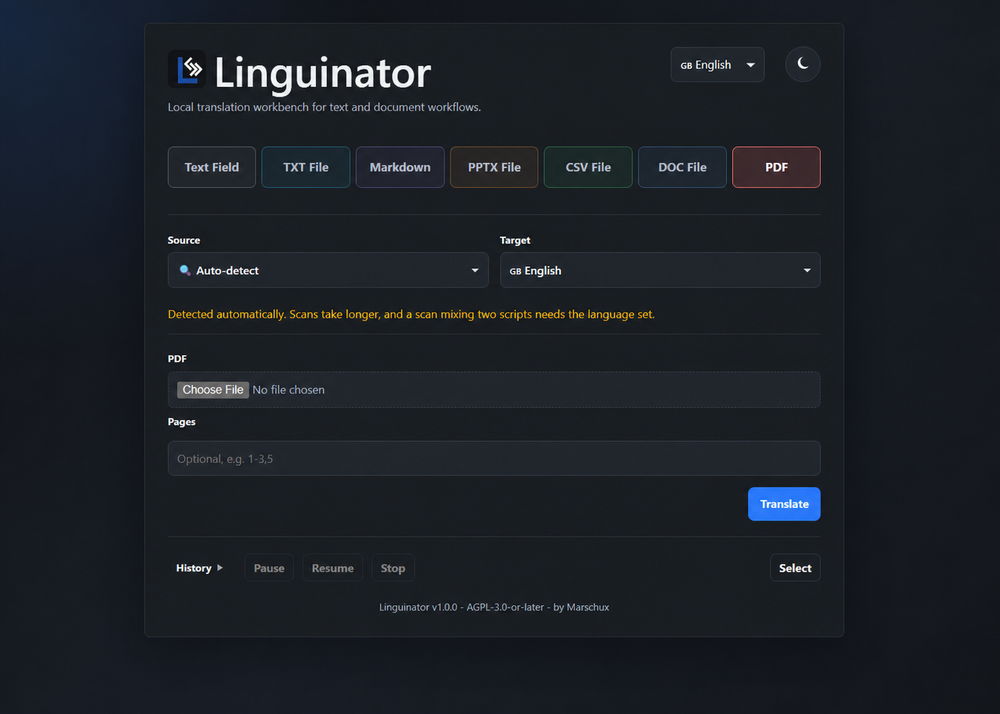
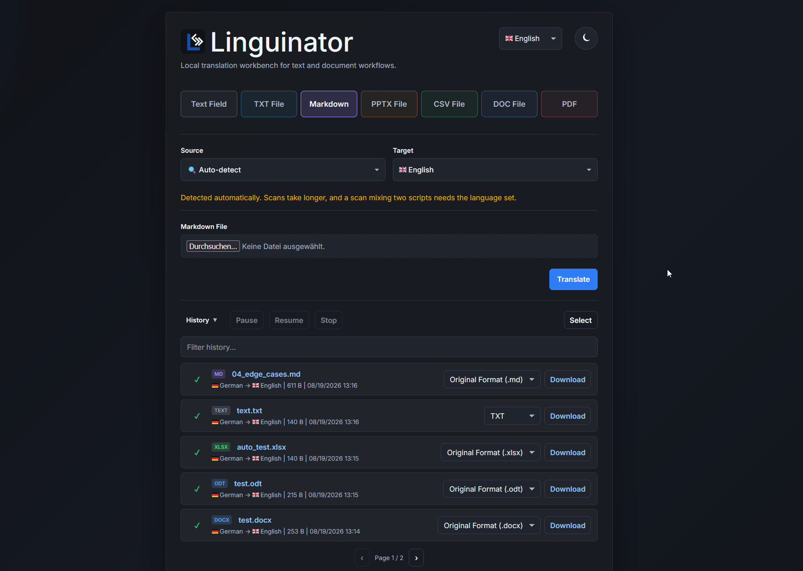

# Linguinator

[](https://github.com/Marschux/Linguinator/tags)
[](LICENSE)
[](https://github.com/Marschux/Linguinator/pkgs/container/linguinator)

Local document translation workbench powered by OPUS-MT.



Open `http://localhost:5051/` (or your configured `LINGUINATOR_PORT`/reverse-proxy URL) once the
container is running.

## Installation with Docker

1. Clone the repository and switch into its directory.
2. Copy [`docker/.env.example`](docker/.env.example) to `.env` in the repository root and adjust
   the settings, especially authentication before exposing the service.
3. Make sure the external Docker network `proxy-net` exists (create it once with
   `docker network create proxy-net`, or adjust [`docker/compose.yml`](docker/compose.yml) for your
   setup).
4. Start Linguinator:

```bash
docker compose -f docker/compose.yml pull
docker compose -f docker/compose.yml up -d
```

Open `http://localhost:5051/` after the container becomes healthy. Useful maintenance commands:

```bash
docker compose -f docker/compose.yml logs -f linguinator
docker compose -f docker/compose.yml restart linguinator
docker compose -f docker/compose.yml down
```

The compose file uses the published image from the GitHub Container Registry. To build locally,
append `--build` to the `up` command.

## Languages

English, German, French, Spanish, Italian, Dutch, Portuguese, Polish, Russian, Ukrainian, Swedish,
Danish, Finnish, Greek, Hungarian, Bulgarian, Chinese, Japanese, Turkish, Latin — any pair works.
Pairs with a dedicated bilingual model (`app/opus_pairs.json`, ~170 pairs, shown per selection in
the UI and via `/languages`) translate better than the multilingual fallback the rest use.




Other notes:

- PDF translation preserves layout by default (reflows into the original lines, images/graphics
  untouched), with automatic OCR fallback for scans. Plain text/Markdown/PDF/DOCX downloads are
  always available too.
- Original-format export also covers ODT, PPTX, HTML, SRT/VTT, JSON/YAML, PO, and XLIFF.
- History (with retained source files) is kept locally and cleaned up after the configured
  retention time.
- GPU: uncomment the `deploy` block in `docker/compose.yml` (host needs the NVIDIA container
  runtime); CPU otherwise.

## License

AGPL-3.0-or-later. See `LICENSE`.

Translation is powered by the [OPUS-MT](https://github.com/Helsinki-NLP/Opus-MT) models from the
University of Helsinki's Language Technology Research Group (Helsinki-NLP), commercially usable
and licensed per model as either Apache-2.0 or CC-BY-4.0 (the latter requires attribution, given
here). `app/opus_pairs.json` (generated by `tools/generate_opus_pairs.py`) records the license of
every dedicated pair model actually in use; the fallback model,
`Helsinki-NLP/opus-mt-tc-bible-big-mul-mul`, is Apache-2.0.

### Model attribution

Linguinator uses the following 21 OPUS-MT models under [Creative Commons
Attribution 4.0 International](https://creativecommons.org/licenses/by/4.0/):

- [Helsinki-NLP/opus-mt-tc-big-bg-en](https://huggingface.co/Helsinki-NLP/opus-mt-tc-big-bg-en)
- [Helsinki-NLP/opus-mt-tc-big-de-es](https://huggingface.co/Helsinki-NLP/opus-mt-tc-big-de-es)
- [Helsinki-NLP/opus-mt-tc-big-el-en](https://huggingface.co/Helsinki-NLP/opus-mt-tc-big-el-en)
- [Helsinki-NLP/opus-mt-tc-big-en-bg](https://huggingface.co/Helsinki-NLP/opus-mt-tc-big-en-bg)
- [Helsinki-NLP/opus-mt-en-de](https://huggingface.co/Helsinki-NLP/opus-mt-en-de)
- [Helsinki-NLP/opus-mt-tc-big-en-el](https://huggingface.co/Helsinki-NLP/opus-mt-tc-big-en-el)
- [Helsinki-NLP/opus-mt-tc-big-en-es](https://huggingface.co/Helsinki-NLP/opus-mt-tc-big-en-es)
- [Helsinki-NLP/opus-mt-tc-big-en-fi](https://huggingface.co/Helsinki-NLP/opus-mt-tc-big-en-fi)
- [Helsinki-NLP/opus-mt-tc-big-en-fr](https://huggingface.co/Helsinki-NLP/opus-mt-tc-big-en-fr)
- [Helsinki-NLP/opus-mt-tc-big-en-hu](https://huggingface.co/Helsinki-NLP/opus-mt-tc-big-en-hu)
- [Helsinki-NLP/opus-mt-tc-big-en-it](https://huggingface.co/Helsinki-NLP/opus-mt-tc-big-en-it)
- [Helsinki-NLP/opus-mt-tc-big-en-pt](https://huggingface.co/Helsinki-NLP/opus-mt-tc-big-en-pt)
- [Helsinki-NLP/opus-mt-tc-big-en-tr](https://huggingface.co/Helsinki-NLP/opus-mt-tc-big-en-tr)
- [Helsinki-NLP/opus-mt-tc-big-fi-en](https://huggingface.co/Helsinki-NLP/opus-mt-tc-big-fi-en)
- [Helsinki-NLP/opus-mt-tc-big-fr-en](https://huggingface.co/Helsinki-NLP/opus-mt-tc-big-fr-en)
- [Helsinki-NLP/opus-mt-tc-big-hu-en](https://huggingface.co/Helsinki-NLP/opus-mt-tc-big-hu-en)
- [Helsinki-NLP/opus-mt-tc-big-it-en](https://huggingface.co/Helsinki-NLP/opus-mt-tc-big-it-en)
- [Helsinki-NLP/opus-mt-ru-en](https://huggingface.co/Helsinki-NLP/opus-mt-ru-en)
- [Helsinki-NLP/opus-mt-tc-big-tr-en](https://huggingface.co/Helsinki-NLP/opus-mt-tc-big-tr-en)
- [Helsinki-NLP/opus-mt-zh-en](https://huggingface.co/Helsinki-NLP/opus-mt-zh-en)
- [Helsinki-NLP/opus-mt-tc-big-zh-ja](https://huggingface.co/Helsinki-NLP/opus-mt-tc-big-zh-ja)

Attribution: Helsinki-NLP, Language Technology Research Group, University of
Helsinki. The model files are used without modification. Their model cards
contain further information about source code, training data and notices.

Model cards: https://huggingface.co/Helsinki-NLP

The fallback model is fixed in `app/main.py` rather than configurable, so that this section stays
true for every deployment. Before swapping it there, or extending `app/opus_pairs.json`, check that
model's own license and training-data rights.

## AI use

Most of this project's code was written with AI assistance (Claude Code). Commits and design
decisions were reviewed by the maintainer.

## Links

- [Wiki](https://github.com/Marschux/Linguinator/wiki) — API reference, environment
  variables, where data is stored.
- [Issues](https://github.com/Marschux/Linguinator/issues)
- [Container registry](https://github.com/Marschux/Linguinator/pkgs/container/linguinator)
